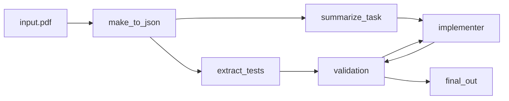
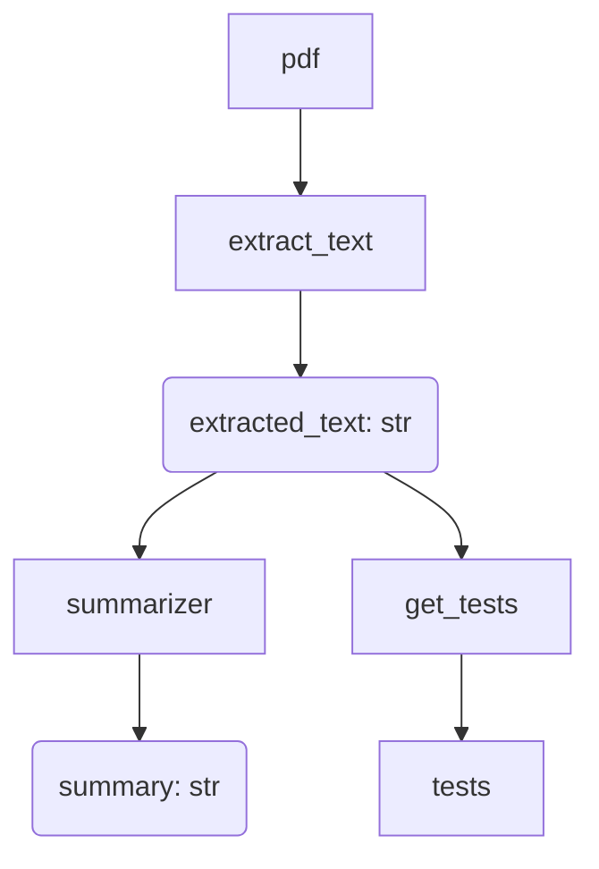

## Disclaimer: This is Alpha Software
Demo depends on third party software and will allow the LLM to access your terminal! Do ***not*** run on non-virtualized environments. Handle with care.

## Introducing Ginny!


## How to Install
Clone the repostitory locally by running the following command:
```
git clone git@github.com:stavros-mhs/ginny
```
Afterwards `cd ginny` to move into the directory and create a python virtual environment
```
python3 -m venv venv
```
and activate it using:
```
. ./venv/bin/active
```
Finally, to install dependencies firstly `pip install poetry` and afterwards run: `poetry install`

## Features
Ginny supports (as of now) three utilities:
1. summarize
2. implement
3. validate

### summarize
`ginny summarize` expects as input a pdf that contains a task for ginny to summarize. By running `ginny summarize path/to/file.pdf`, ginny will parse the pdf and write the summary in summary.txt

### implement
`ginny implement` expects a task to implement software for. By running `ginny implement "make code that solves this assignment"`, ginny will attempt to create an implementation that solves the assignment given.

For example, if you have a `file.pdf` that contains some coding assignment, you can use `ginny summarize path/to/file.pdf` and copy and paste the summary as input to `ginny implement "pdf summary contents"`

### validate

`ginny validate` expects as input a pdf that contains test cases for some software implementation. By running `ginny validate path/to/file.pdf`, ginny will attempt to extract the test cases contained in the pdf and run them to validate the software. The results will of the execution will be written in `validate.txt`.

### validate

## About WIP (Work In Progress) branch
In the WIP branch I've implemented a more sophisticated workflow cycle (see the diagram below):



The cycle needs to be run manually:

**pre-requisites:**
* OpenAI API key required:
* you'll need a pdf that contains:
    * a coding task you want to solve - somewhere around undergraduate level of difficulty
    * test cases to validate an implementation of the task

**Note:** Compilation of code needs to be done manually, I haven't yet automated that (will attempt to in the future).

1. export OPENAI_API_KEY="...your API key..."

all the commands that follow need to be run inside the root of the project for import paths to work (will be simpler once I finish the workflow)

2. Run `python3 -m goal-node ./path/to/input.pdf`

this will get summarize the task contained in the pdf you inputed and write it in summary.txt.

3. copy the contents of summary.txt and run `python3 -m implementation-node.main "...what you copied from summary.txt..."`

this will create an implementation attempting to solve the problem

4. finally, run `python3 -m valdiation.validation ./path/to/input.pdf`

the path for `input.pdf` is needed to extract the test cases so you can validate\* the code made in step 3.

\* validation will crush in case of timeouts
## Architecture
we have the following nodes:

Agent Nodes:
1. Summarizer --> summarizes the task
    + str --> str
2. Implementer --> makes the implementation
    + str -->? test_out --> source.c

Automated Nodes:
1. make_json --> turns pdf to json
    + file.pdf --> json
    + json has pages field
2. get_tests --> extracts test cases
    + json --> python dict of the form key=command, value=expected_out
3. validation --> validates the implementation given the test cases
    + python dict --> boolean



# summarizer --> ReadPage --> summarizer

## NOTE TO SELF: READ TO STR DOES NOT NEED TOOLS. Invoke seems to be enough.