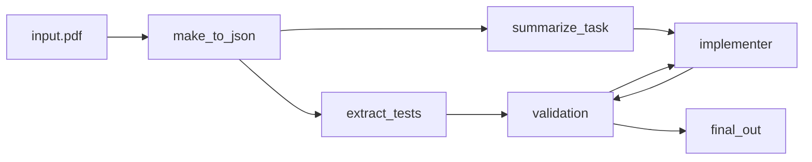

## Disclaimer: This is Alpha Software
Demo depends on third party software and will allow the LLM to access your terminal! Do ***not*** run on non-virtualized environments. Handle with care.

## Install
Set up a virtual environment using:
```
python3 -m venv venv
. ./venv/bin/active
```
and then run 
```
poetry install
```

if you haven't install poetry, you can do it through ```pip install poetry``` or your package manager (e.g., ```apt install poetry``` on Ubuntu).

## Running
To run, the app needs access to an AI provider, the simplest one is through:

```export OPENAI_API_KEY="...you key here..."```

to run the demo use:

```poetry run main "what you want the LLM assistant to do for you"```

(keep in mind the System Prompt on blocks.py)

## About WIP (Work In Progress) branch
In the WIP branch I've implemented a more sophisticated workflow cycle (see the diagram below):



The cycle needs to be run manually:

**pre-requisites:**
* OpenAI API key required:
* you'll need a pdf that contains:
    * a coding task you want to solve - somewhere around undergraduate level of difficulty
    * test cases to validate an implementation of the task

**important:** run all of these on a python virutal environment
* to make a python virtual environment: `python3 -m venv venv`
this creates a virtual environment named venv. you need to source it next.
* run `. ./venv/bin/activate`

note: compilation of code needs to be done manually, I haven't yet automated that (but will attempt to in the future)

1. export OPENAI_API_KEY="...your API key..."

all the commands that follow need to be run inside the root of the project for import paths to work (will be simpler once I finish the workflow)

2. Run `python3 -m goal-node ./path/to/input.pdf`

this will get summarize the task contained in the pdf you inputed and write it in summary.txt.

3. copy the contents of summary.txt and run `python3 -m implementation-node.main "...what you copied from summary.txt..."` 

this will create an implementation attempting to solve the problem

4. finally, run `python3 -m valdiation.validation ./path/to/input.pdf`

the path for `input.pdf` is needed to extract the test cases so you can validate\* the code made in step 3.

\* validation will crush in case of timeouts