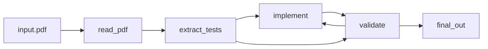

## Disclaimer: This is Alpha Software
Ginny depends on third party software and uses LLMs to generate code that will be run and tested on your terminal! Handle with care. I suggest you run Ginny in a virtual environment ([go to relevant section](#creating-a-virtual-environment))

## Introducing Ginny!
Ginny is a CLI tool that automates the following workflow:


The user provides a PDF file (`input.pdf`) containing the specifications for some software, along with the test cases that the implementation must pass.

Ginny then:
+ 📖 Reads and converts the PDF to text
+ 🧪 Extracts the test cases
+ 🛠️ Attempts to implement a solution
+ 🔁 Iterates on the implementation until it passes all tests

🧩 Currently, several parts of this workflow are implemented as standalone utilities.These are the following commands:
+ `ginny summarize ./path/to/input.pdf` Summarizes the task described in the PDF and saves it to `summary.txt`. This can be used later as input for the `implement` command.

+ `ginny implement "task to implement"` Attempts to generate code to solve the given task.

+ `ginny validate ./path/to/input.pdf`Extracts test cases from the PDF and runs them against the current implementation. Results are written to `logs.txt`.

## How to install Ginny

**pre-requisites:**
* OpenAI API key required

Clone the repostitory locally by running the following command:
```
git clone git@github.com:stavros-mhs/ginny
```
### Creating a Virtual Environment
I recommend using Ginny in a virtual environment. Firstly `cd ginny` to move to the cloned repository. The easiet way is to create a python virtual environment by running:
```
python3 -m venv venv
```
and activate it using:
```
. ./venv/bin/activate
```
Dependencies are handled by poetry so if you don't have it install it by via pip by running: `pip install poetry` and finally run: `poetry install`.

## Currently working on...

I'm currently working integrating pytest to better the validation utility.

## Future Plans

Working on `solve` utility that combines all three minor utilities to implement the cycle shown in [graph](#introducing-ginny).